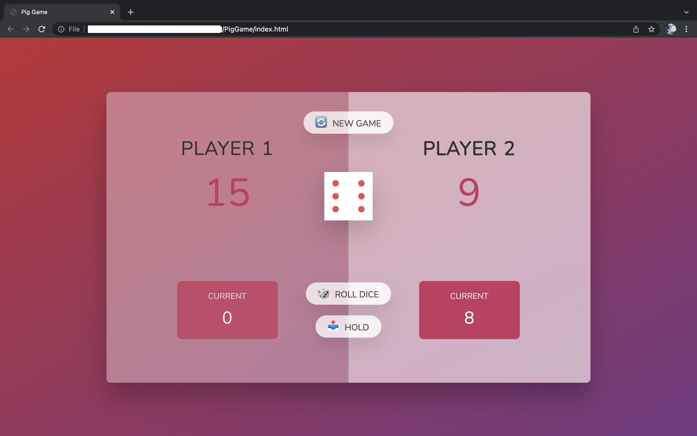
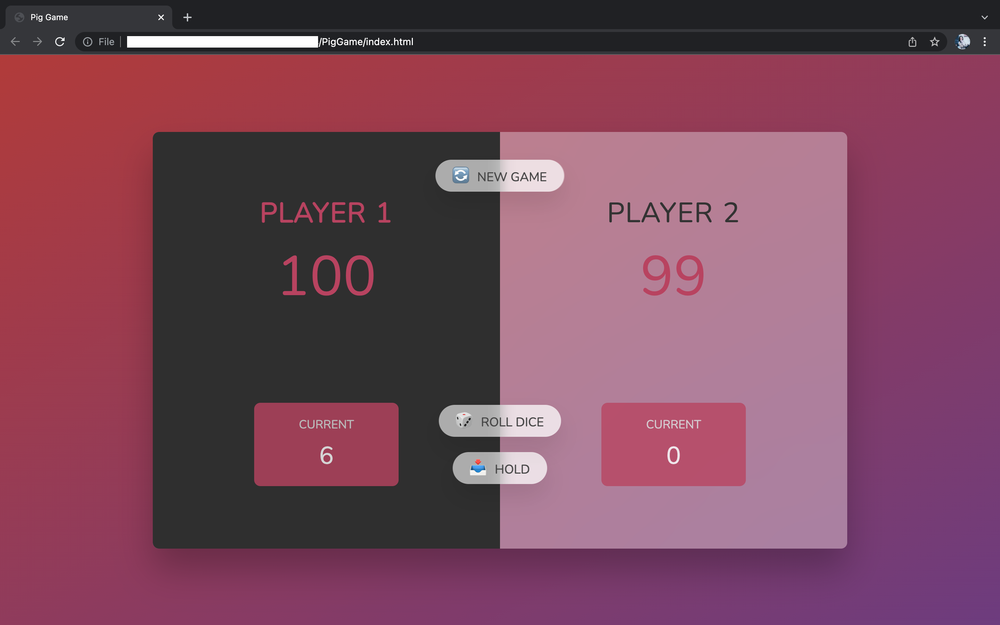

# PigGame

A fun 2-player game, build with JavaScript.

## How to run locally

- Fork and clone repository
- Open index.html in a browser
- Start playing :)

## Rules

- Player 1 starts and rolls the dice 🎲.
- The value of the dice is added to the player's _current_ score.
- After each roll, the player has two options -> either **FOLD** and add his _current_ score to his _total_ score, or **CONTINUE ROLLING** to stack even more points to his _current_ score.
- If the dice rolls 1️⃣ -> the player loses all his _current_ score 😢 and the other player starts rolling.
- Whoever reaches 100 points _total_ score first, wins 🎉.

## Screenshots

- Playing
  
- Player 1 wins 🎉
  
